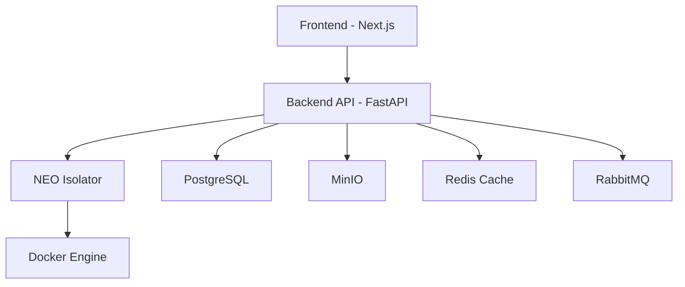

# NEO Architecture Documentation

## Overview

NEO (formerly Suna) has been completely redesigned to eliminate dependencies on external services like Supabase and Daytona, creating a fully self-contained, locally deployable AI agent system.

## Architecture Components

### 1. Database Layer (PostgreSQL)
**Replaces:** Supabase Database
- **Service:** PostgreSQL 15
- **Features:**
  - User management and authentication
  - Project and thread management
  - Message storage and retrieval
  - File metadata storage
  - Session management
- **Location:** `backend/database/`

### 2. Authentication Service
**Replaces:** Supabase Auth
- **Technology:** JWT-based authentication with bcrypt password hashing
- **Features:**
  - User registration and login
  - Token-based session management
  - Password reset and email verification
  - Role-based access control
- **Location:** `backend/services/auth.py`

### 3. Storage Service (MinIO)
**Replaces:** Supabase Storage
- **Technology:** MinIO S3-compatible object storage
- **Features:**
  - File upload and download
  - Image processing and storage
  - Bucket management
  - Public and private file access
- **Location:** `backend/services/storage.py`

### 4. NEO Isolator
**Replaces:** Daytona
- **Technology:** Custom Docker-based container isolation
- **Features:**
  - Secure code execution environments
  - Container lifecycle management
  - File system operations
  - Terminal access via WebSocket
  - Resource limits and security controls
- **Location:** `backend/isolator/`

### 5. Backend API
- **Technology:** FastAPI with async/await
- **Features:**
  - RESTful API endpoints
  - WebSocket support for real-time features
  - Authentication middleware
  - Request/response logging
- **Location:** `backend/api_new.py`

### 6. Frontend Application
- **Technology:** Next.js with TypeScript
- **Features:**
  - Custom API client (replaces Supabase client)
  - Authentication UI
  - Chat interface
  - Dashboard and project management
- **Location:** `frontend/src/`

## Service Dependencies



## Data Flow

### 1. User Authentication
1. User submits credentials to `/auth/login`
2. Backend validates against PostgreSQL
3. JWT tokens generated and returned
4. Frontend stores tokens for subsequent requests

### 2. Agent Execution
1. User sends message via Frontend
2. Backend creates thread in PostgreSQL
3. Backend requests container from Isolator
4. Isolator creates Docker container
5. Agent code executes in isolated environment
6. Results stored in PostgreSQL and MinIO

### 3. File Operations
1. Files uploaded via Frontend
2. Backend stores in MinIO
3. Metadata saved in PostgreSQL
4. Public URLs generated for access

## Security Features

### Container Isolation
- **No-new-privileges:** Prevents privilege escalation
- **Capability dropping:** Removes unnecessary Linux capabilities
- **Resource limits:** CPU and memory constraints
- **Network isolation:** Containers run in isolated network
- **Read-only filesystem:** Base filesystem is read-only
- **Temporary filesystem:** `/tmp` mounted with restrictions

### Authentication Security
- **Password hashing:** bcrypt with salt
- **JWT tokens:** Signed with secret key
- **Token expiration:** Configurable expiration times
- **Session management:** Database-backed sessions
- **CORS protection:** Configurable CORS policies

### Database Security
- **Connection pooling:** Managed connections
- **Prepared statements:** SQL injection prevention
- **Row-level security:** User-based data access
- **Encrypted connections:** TLS/SSL support

## Configuration

### Environment Variables
All configuration is managed through environment variables:
- Database connection settings
- JWT secrets and expiration times
- MinIO credentials and endpoints
- LLM API keys
- Service URLs and ports

### Docker Compose
The entire stack is orchestrated using Docker Compose:
- Automatic service dependencies
- Health checks for all services
- Volume management for data persistence
- Network isolation between services

## Deployment

### Local Development
```bash
# Clone repository
git clone https://github.com/kortix-ai/NEO.git
cd NEO

# Copy environment file
cp backend/.env.example backend/.env

# Start services
docker-compose up -d
```

### Production Deployment
1. Configure environment variables for production
2. Set up SSL/TLS certificates
3. Configure reverse proxy (nginx/traefik)
4. Set up monitoring and logging
5. Configure backup strategies

## Migration from Supabase

### Database Migration
1. Export data from Supabase
2. Transform schema to PostgreSQL format
3. Import data into new PostgreSQL instance
4. Update application code to use new database service

### Authentication Migration
1. Export user data from Supabase Auth
2. Hash passwords using bcrypt
3. Create user accounts in new system
4. Update frontend to use new auth endpoints

### Storage Migration
1. Download files from Supabase Storage
2. Upload files to MinIO
3. Update file references in database
4. Update application code to use new storage service

## Performance Considerations

### Database Optimization
- Connection pooling with asyncpg
- Proper indexing on frequently queried columns
- Query optimization and monitoring
- Regular maintenance and vacuuming

### Container Management
- Container reuse for similar workloads
- Resource monitoring and limits
- Automatic cleanup of unused containers
- Image caching and optimization

### Caching Strategy
- Redis for session storage
- Application-level caching for frequently accessed data
- CDN for static assets
- Database query result caching

## Monitoring and Observability

### Logging
- Structured logging with JSON format
- Centralized log aggregation
- Log rotation and retention policies
- Error tracking and alerting

### Metrics
- Application performance metrics
- Database performance monitoring
- Container resource usage
- API endpoint response times

### Health Checks
- Service health endpoints
- Database connectivity checks
- Storage service availability
- Container orchestration health

## Backup and Recovery

### Database Backups
- Automated PostgreSQL backups
- Point-in-time recovery capability
- Backup encryption and compression
- Off-site backup storage

### File Storage Backups
- MinIO bucket replication
- Incremental backup strategies
- Backup verification and testing
- Disaster recovery procedures

## Scaling Considerations

### Horizontal Scaling
- Multiple backend API instances
- Load balancing with nginx/traefik
- Database read replicas
- Container orchestration with Kubernetes

### Vertical Scaling
- Resource allocation optimization
- Database performance tuning
- Container resource limits
- Memory and CPU optimization

## Development Workflow

### Local Development
1. Use Docker Compose for local services
2. Hot reload for backend and frontend
3. Database migrations and seeding
4. Testing with isolated environments

### CI/CD Pipeline
1. Automated testing on pull requests
2. Docker image building and scanning
3. Deployment to staging environment
4. Production deployment with rollback capability